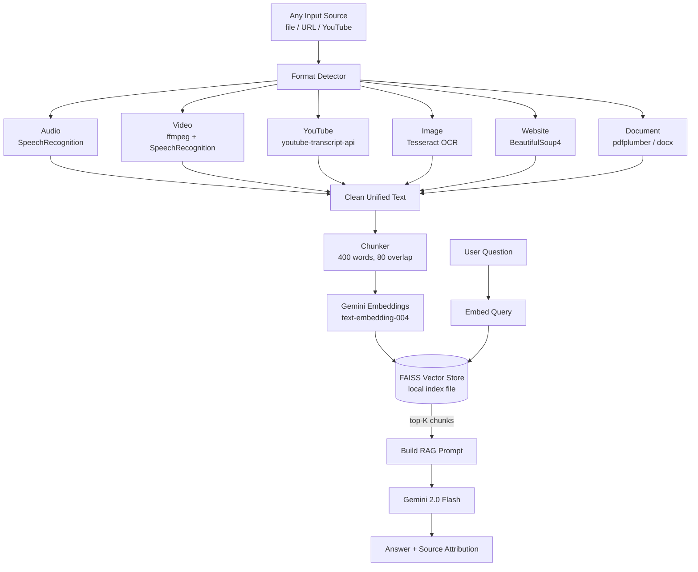
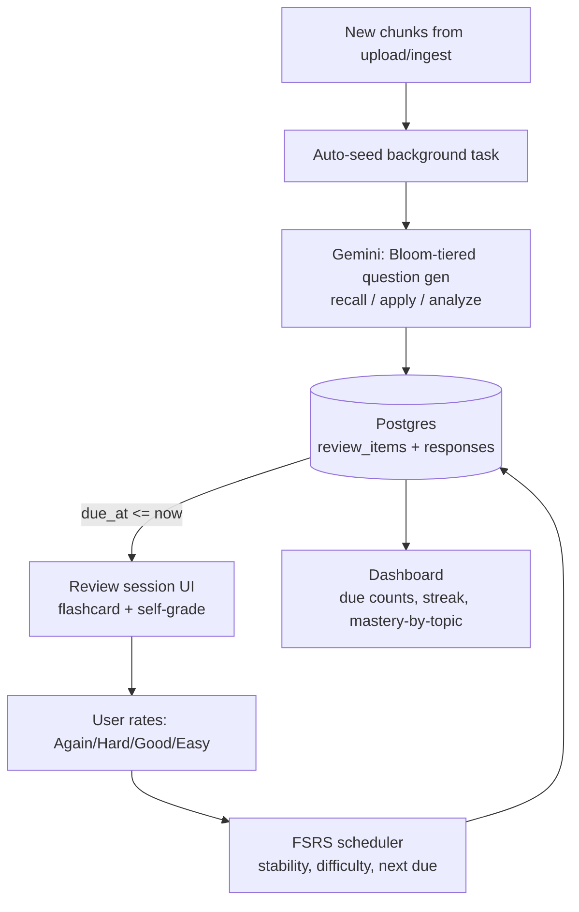

# AI Teaching Assistant

A RAG-powered AI teacher with **persistent learner memory**. Upload PDFs, audio, video, images, paste YouTube links, or website URLs — everything gets transcribed/extracted, chunked, embedded, and stored for retrieval-augmented generation with Google Gemini. Then, unlike a stateless chatbot, it **remembers what you've learned**: every upload is auto-turned into Bloom-tiered review cards scheduled by the [FSRS](https://github.com/open-spaced-repetition) spaced-repetition algorithm, so you revisit material right before you'd forget it.

> **Why this exists:** ChatGPT and Gemini answer the same way on day 1 and day 30 — they have no memory of what you understood or forgot. The differentiator here is **persistent learner state**: Postgres tracks what you know, FSRS schedules *when* to show it again, and the dashboard surfaces *what to work on next*.

Vercel Link: https://ai-teaching-assistant-iota.vercel.app/


## Features

- **Multi-format ingestion** — PDF, DOCX,PNG, JPG, and more
- **YouTube ingestion** — Paste a YouTube URL to pull and index the transcript
- **Website scraping** — Paste any URL to extract and index its readable content
- **Audio/video transcription** — Automatic transcription via SpeechRecognition
- **Image OCR** — Extract text from images using Tesseract
- **Chat with context** — Ask questions and get Gemini-powered answers grounded in your material
- **Smart teaching modes** — ELI5, Beginner, Intermediate, Advanced explanations
- **Quiz generation** — Auto-generate MCQs from your material to test understanding
- **Spaced-repetition review** — Every upload auto-generates Bloom-tiered review cards (recall / apply / analyze), scheduled by the FSRS algorithm so you review just before you'd forget
- **Self-grading flashcards** — Type an answer, get it LLM-graded, then rate recall (Again / Hard / Good / Easy); intervals adapt automatically
- **Learning dashboard** — At-a-glance "what should I work on?": cards due now/today, total cards, day streak, and mastery-by-topic chart
- **Persistent learner state** — Postgres remembers your review history across sessions; nothing is forgotten between visits
- **Topic filtering** — Organize material by topic and scope queries accordingly
- **Source attribution** — See which documents were used to answer each question

## Architecture



### Spaced-repetition layer

The retrieval pipeline above feeds a persistent review loop. New chunks become review cards; FSRS decides when each card comes back.



### Tech Stack

| Layer | Tools |
|-------|-------|
| Frontend | React 19, Vite, CSS Modules, Lucide icons |
| Backend | FastAPI, Pydantic v2, Python 3.11+ |
| LLM | Google Gemini (gemini-2.0-flash default) |
| Embeddings | Google Gemini text-embedding-004 |
| Vector Store | FAISS (local, file-based) |
| Learner state | Postgres (Neon) via psycopg 3 + connection pool |
| Scheduling | FSRS (Free Spaced Repetition Scheduler) |
| Transcription | SpeechRecognition (Google free) + ffmpeg |
| YouTube | youtube-transcript-api |
| OCR | pytesseract + Pillow |
| Scraping | BeautifulSoup4 + requests |
| Documents | pdfplumber, python-docx |

## Benchmarks & Evaluation

This project ships with a reproducible eval harness in [`backend/evals/`](backend/evals/README.md) that measures retrieval quality on a curated golden set.

To reproduce:

```bash
cd backend
python -m evals.run_eval --baseline           # retrieval metrics, no LLM call
python -m evals.run_eval --sweep-chunks       # chunk-size ablation
python -m evals.run_eval --sweep-topk         # top-K ablation
python -m evals.run_eval --baseline --end-to-end   # full RAG including Gemini
```

### Baseline (top_k=5, chunk=400, overlap=80)

Measured on the curated 15-question golden set in [`backend/evals/datasets/`](backend/evals/datasets/). Re-run `python -m evals.run_eval --baseline` to reproduce.

| Metric | Value |
|--------|-------|
| Recall@5 (source) | 0.667 |
| MRR (source)      | 0.478 |
| Precision@5       | 0.333 |
| Retrieval P95     | 721 ms |
| Chunks indexed    | 6 (3 docs) |

### Chunk-size ablation

| chunk_size | overlap | chunks indexed | recall@5 | MRR | P95 ms |
|-----------:|--------:|---------------:|---------:|----:|-------:|
| 200 | 40  | 9 | 0.333 | 0.333 | 629 |
| 400 | 80  | 6 | 0.667 | 0.478 | 721 |
| 800 | 160 | 3 | 1.000 | 1.000 | 550 |

### Top-K ablation (chunk=400)

| top_k | recall@k | MRR | precision@k | P95 ms |
|------:|---------:|----:|------------:|-------:|
| 1  | 0.333 | 0.333 | 0.333 | 656 |
| 3  | 0.667 | 0.478 | 0.333 | 570 |
| 5  | 0.667 | 0.478 | 0.333 | 614 |
| 10 | 0.667 | 0.478 | 0.333 | 545 |

**Result:** Tuned `TOP_K` from 5 → 3 (same recall, smaller and less noisy LLM context).
Kept `CHUNK_SIZE=400` — the chunk=800 "win" is a corpus-size artifact, not a real tuning improvement.

## Quick Start

### Prerequisites

- Python 3.11+
- Node.js 18+
- A Google Gemini API key (free at https://aistudio.google.com/apikey)
- ffmpeg (for video processing): `brew install ffmpeg`
- Tesseract (for image OCR): `brew install tesseract`

### 1. Clone and configure

```bash
cp .env.example .env
# Edit .env and add your GEMINI_API_KEY and DATABASE_URL
```

For the review/dashboard features you need a Postgres database. The free tier of
[Neon](https://neon.tech) works well — create a project, copy the pooled
connection string into `DATABASE_URL`, then apply the schema:

```bash
psql "$DATABASE_URL" -f backend/db/schema.sql
```

> Chat, quiz, and ingestion work without a database — only the spaced-repetition
> review and dashboard require `DATABASE_URL`.

### 2. Start the backend

```bash
cd backend
pip install -r requirements.txt
uvicorn app.main:app --reload --port 8000
```

### 3. Start the frontend

```bash
cd frontend
npm install
npm run dev
```

Open **http://localhost:3000** in your browser.

### 4. Use the app

1. Go to the **Upload** tab
2. Paste a YouTube link or website URL and click **Ingest**
3. Or drag-and-drop any supported file (PDF, audio, video, image, etc.)
4. Switch to **Chat** and ask questions about the material
5. Try **Quiz** to generate practice questions
6. Open **Review** to study the cards auto-generated from your uploads — rate each one and watch the intervals adapt
7. Check the **Dashboard** to see what's due, your streak, and mastery by topic

### How spaced repetition works

Every upload kicks off a background task that turns the new chunks into review
cards via Gemini, at three Bloom's-taxonomy levels (**recall**, **apply**,
**analyze**). Each card starts due immediately.

In a review session you recall the answer (optionally typing it for LLM grading)
and rate how well you knew it: **Again / Hard / Good / Easy**. The
[FSRS](https://github.com/open-spaced-repetition) scheduler updates the card's
*stability* and *difficulty* and sets the next due date — wrong answers come back
soon, easy ones get pushed out further (roughly: new → 1d, correct → 3d, correct
again → 8d…). Over time you only see what you're about to forget.

## Supported Input Formats

| Category | Extensions / Sources |
|----------|---------------------|
| Text | `.pdf`, `.txt`, `.md`, `.docx` |
| Audio | `.mp3`, `.wav`, `.m4a`, `.ogg`, `.flac` |
| Video | `.mp4`, `.mkv`, `.avi`, `.mov`, `.webm` |
| Image | `.png`, `.jpg`, `.jpeg`, `.bmp`, `.tiff`, `.webp` |
| URL | YouTube video links, any website URL |

## API Endpoints

| Method | Path | Description |
|--------|------|-------------|
| POST | `/api/chat/` | Ask a question (RAG) |
| POST | `/api/upload/` | Upload and ingest a file (any format) |
| POST | `/api/ingest/url` | Ingest from a YouTube or website URL |
| POST | `/api/quiz/` | Generate quiz questions |
| POST | `/api/review/seed` | Generate review cards from a source/topic (also runs automatically on upload) |
| GET | `/api/review/due` | Fetch cards due for review |
| POST | `/api/review/submit` | Submit a rating; FSRS updates the card's next due date |
| GET | `/api/review/stats` | Dashboard stats: due now/today, streak, mastery by topic |
| GET | `/api/topics/` | List all indexed topics |
| GET | `/api/health` | Health check + stats |

## Environment Variables

| Variable | Default | Description |
|----------|---------|-------------|
| `GEMINI_API_KEY` | — | Required. Your Google Gemini API key |
| `DATABASE_URL` | — | Required for review/dashboard. Postgres connection string (e.g. a Neon pooled URL) |
| `DEMO_USER_ID` | `00000000-…-0001` | UUID of the demo user that owns review cards (single-user demo deployment) |
| `CHAT_MODEL` | `gemini-2.0-flash` | Chat completion model |
| `EMBEDDING_MODEL` | `models/text-embedding-004` | Embedding model |
| `CHUNK_SIZE` | `400` | Words per chunk |
| `CHUNK_OVERLAP` | `80` | Overlap words between chunks |
| `TOP_K` | `5` | Number of context chunks retrieved |
| `RATE_LIMIT_CHAT` | `5/minute` | Per-IP rate limit on `POST /api/chat/` |
| `RATE_LIMIT_QUIZ` | `2/minute` | Per-IP rate limit on `POST /api/quiz/` |
| `RATE_LIMIT_UPLOAD` | `5/minute` | Per-IP rate limit on `POST /api/upload/` |
| `RATE_LIMIT_INGEST` | `15/minute` | Per-IP rate limit on `POST /api/ingest/url` |

## Project Structure

```
AI-Teaching-Assistant/
├── backend/
│   ├── app/
│   │   ├── core/              # Configuration
│   │   ├── models/            # Pydantic schemas
│   │   ├── routers/           # API endpoints
│   │   │   ├── chat.py             # RAG chat
│   │   │   ├── upload.py           # File upload (auto-seeds review cards)
│   │   │   ├── ingest.py           # URL ingestion (auto-seeds review cards)
│   │   │   ├── quiz.py             # Quiz generation
│   │   │   ├── review.py           # Spaced-repetition: seed/due/submit/stats
│   │   │   └── topics.py           # Topic listing
│   │   └── services/          # Business logic
│   │       ├── chunker.py          # Text chunking
│   │       ├── embeddings.py       # Gemini embeddings
│   │       ├── ingestion.py        # Unified ingestion pipeline
│   │       ├── llm.py              # Gemini integration (chat, quiz, review Qs, grading)
│   │       ├── vector_store.py     # FAISS vector DB
│   │       ├── db.py               # Postgres connection pool + transaction helper
│   │       ├── scheduler.py        # FSRS scheduling seam (review math)
│   │       ├── review_repo.py      # CRUD + stats aggregations for review_items
│   │       ├── review_seeder.py    # Shared seed logic (endpoint + auto-seed task)
│   │       └── processors/         # Format-specific extractors
│   │           ├── transcribe.py        # Audio/video → SpeechRecognition
│   │           ├── youtube.py           # YouTube transcript
│   │           ├── ocr.py              # Image → Tesseract
│   │           ├── scraper.py          # Website → BeautifulSoup
│   │           └── docx_reader.py      # DOCX extraction
│   ├── db/
│   │   └── schema.sql         # Postgres schema: users, review_items, responses
│   ├── tests/                 # pytest: scheduler + review_repo
│   ├── uploads/               # Uploaded files
│   ├── data/                  # FAISS index storage
│   ├── evals/                 # RAG evaluation harness (golden set, metrics, runner)
│   └── requirements.txt
├── frontend/
│   ├── src/
│   │   ├── components/        # React UI components
│   │   ├── services/          # API client
│   │   └── styles/            # Global CSS
│   └── package.json
├── .env.example
└── README.md
```
